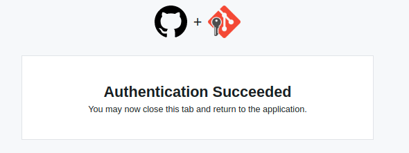

### 概要
- 2021年8月13日をもって、パスワードでのGitHubユーザ認証が廃止となり、Access Tokenでの認証が必須になった（[参考](https://github.blog/2020-12-15-token-authentication-requirements-for-git-operations/)）
- そこで、GCM Core経由でAccess Tokenを設定し、ユーザ認証をする方法を記しておく

### What is GCM Core?
- [https://github.com/microsoft/Git-Credential-Manager-Core](https://github.com/microsoft/Git-Credential-Manager-Core)
- Git Credentials Manage Coreの略
- Gitのcredentialを管理するためのツール
- 2021年8月14日現在、Windows/MacOSはProductionリリースがされており、LinuxはEarly previewの段階

## 手順

### 1. GCM Coreのインストール

- 自分の環境はUbuntu 20.04なので、[こちら](https://github.com/microsoft/Git-Credential-Manager-Core/releases/tag/v2.0.498)から .deb をダウンロード
- 以下のコマンドでインストールとconfigurationを行う（[こちら](https://github.com/microsoft/Git-Credential-Manager-Core#linux-install-instructions)の手順通り）

```bash
sudo dpkg -i <.debファイルのパスを指定>
git-credential-manager-core configure
```

### 2. gitの設定

- [こちら](https://github.com/microsoft/Git-Credential-Manager-Core/blob/main/docs/linuxcredstores.md)の手順に従って、credentials storeの設定を行う
- 今回は環境変数ではなく、git globalの設定に書き込む方式で行く

```bash
git config --global credential.credentialStore secretservice
```

### 3. Web認証

- 適当なPrivate reposirotyをcloneする
- この時、認証がWeb browser or Access Tokenで行われる（下記質問が出る）

```bash
$ git clone https://github.com/Shunpoco/<private repository>.git
Cloning into '<private repository>'...
Select an authentication method for 'https://github.com/':
  1. Web browser (default)
  2. Personal access token
option (enter for default): 1
```

- 今回は 1 のWeb browser認証を選択
- 以下のような画面になるので Authorize GitCredentialManager をクリック

- 以下のような画面に遷移すれば成功。タブを閉じる

- cloneが進行して完了。今後はPrivate repositoryのcloneやpushなどの動作も認証無しで行うことができる。

```bash
info: please complete authentication in your browser...
remote: Enumerating objects: 374, done.
remote: Counting objects: 100% (374/374), done.
remote: Compressing objects: 100% (265/265), done.
remote: Total 374 (delta 133), reused 287 (delta 49), pack-reused 0
Receiving objects: 100% (374/374), 38.37 KiB | 553.00 KiB/s, done.
Resolving deltas: 100% (133/133), done.
```

## 参考資料

[Creating a personal access token](https://docs.github.com/en/github/authenticating-to-github/keeping-your-account-and-data-secure/creating-a-personal-access-token)

[GitHub - microsoft/Git-Credential-Manager-Core: Secure, cross-platform Git credential storage with authentication to GitHub, Azure Repos, and other popular Git hosting services.](https://github.com/microsoft/Git-Credential-Manager-Core)