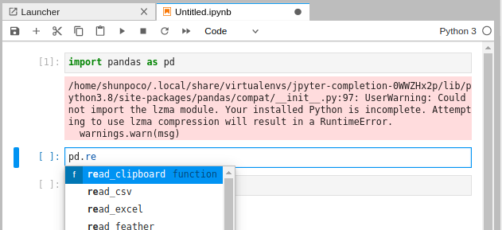
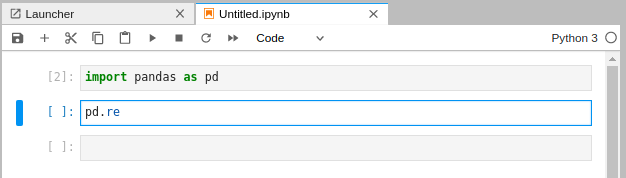

<div style="text-align: center; font-size: 14px; color: grey; margin-bottom: 20px;">this picture is from <a href="https://jupyter.org/" style="text-decoration: none;" >here</a>
</div>

In this article, I introduce what error I caught when using [Jupyterlab](https://github.com/jupyterlab/jupyterlab)'s tab completion.

### Problem
When I launched a new pipenv project for analyzing data, I found that I couldn't use tab-completion (fig.1 and fig.2).


<div style="text-align: center; font-size: 14px; color: grey; margin-bottom: 20px;">Fig.1: Normally, we can use tab-completion on Jupyterlab.</div>


<div style="text-align: center; font-size: 14px; color: grey; margin-bottom: 20px;">Fig.2: Even if we push tab, tab-completion doesn't run.</div>

And in the command line, I caught an error as below.

```bash
[IPKernelApp] ERROR | Exception in message handler:
Traceback (most recent call last):
  File "/home/shunpoco/.local/share/virtualenvs/jpyter-completion-0WWZHx2p/lib/python3.8/site-packages/ipykernel/kernelbase.py", line 261, in dispatch_shell
    yield gen.maybe_future(handler(stream, idents, msg))
  File "/home/shunpoco/.local/share/virtualenvs/jpyter-completion-0WWZHx2p/lib/python3.8/site-packages/tornado/gen.py", line 762, in run
    value = future.result()
  File "/home/shunpoco/.local/share/virtualenvs/jpyter-completion-0WWZHx2p/lib/python3.8/site-packages/tornado/gen.py", line 234, in wrapper
    yielded = ctx_run(next, result)
  File "/home/shunpoco/.local/share/virtualenvs/jpyter-completion-0WWZHx2p/lib/python3.8/site-packages/ipykernel/kernelbase.py", line 576, in complete_request
    matches = yield gen.maybe_future(self.do_complete(code, cursor_pos))
  File "/home/shunpoco/.local/share/virtualenvs/jpyter-completion-0WWZHx2p/lib/python3.8/site-packages/ipykernel/ipkernel.py", line 356, in do_complete
    return self._experimental_do_complete(code, cursor_pos)
  File "/home/shunpoco/.local/share/virtualenvs/jpyter-completion-0WWZHx2p/lib/python3.8/site-packages/ipykernel/ipkernel.py", line 381, in _experimental_do_complete
    completions = list(_rectify_completions(code, raw_completions))
  File "/home/shunpoco/.local/share/virtualenvs/jpyter-completion-0WWZHx2p/lib/python3.8/site-packages/IPython/core/completer.py", line 484, in rectify_completions
    completions = list(completions)
  File "/home/shunpoco/.local/share/virtualenvs/jpyter-completion-0WWZHx2p/lib/python3.8/site-packages/IPython/core/completer.py", line 1818, in completions
    for c in self._completions(text, offset, _timeout=self.jedi_compute_type_timeout/1000):
  File "/home/shunpoco/.local/share/virtualenvs/jpyter-completion-0WWZHx2p/lib/python3.8/site-packages/IPython/core/completer.py", line 1861, in _completions
    matched_text, matches, matches_origin, jedi_matches = self._complete(
  File "/home/shunpoco/.local/share/virtualenvs/jpyter-completion-0WWZHx2p/lib/python3.8/site-packages/IPython/core/completer.py", line 2029, in _complete
    completions = self._jedi_matches(
  File "/home/shunpoco/.local/share/virtualenvs/jpyter-completion-0WWZHx2p/lib/python3.8/site-packages/IPython/core/completer.py", line 1373, in _jedi_matches
    interpreter = jedi.Interpreter(
  File "/home/shunpoco/.local/share/virtualenvs/jpyter-completion-0WWZHx2p/lib/python3.8/site-packages/jedi/api/__init__.py", line 725, in __init__
    super().__init__(code, environment=environment,
TypeError: __init__() got an unexpected keyword argument 'column'
```

### Cause
Jupyterlab uses [IPython](https://github.com/ipython/ipython) in its background, and IPython uses [Jedi](https://github.com/davidhalter/jedi) for its tab completions. Because of Jedi's update to v0.18.0, IPython needs to use libraries `sys` and `traceback` in its codebase, but its versions earlier than v7.20.0 don't contain these libraries. Below is my IPython and Jedi's version which caused the problem.

```bash
$ pipenv run pip freeze | grep '.*\(ipython\|jedi\)'
ipython==7.19.0
ipython-genutils==0.2.0
jedi==0.18.0
```

Reading [this issue](https://github.com/ipython/ipython/issues/12745), we can realize the cause.

### Solution
In IPython v7.20.0 or later versions, this problem fixed (see [this comment](https://github.com/ipython/ipython/issues/12745#issuecomment-753630904)). So we just update our IPython version. For example, I installed v7.22.0.

```bash
pipenv install ipython==7.22.0
```

Now we can use tab completion on Jupyterlab (fig.3)!


<div style="text-align: center; font-size: 14px; color: grey; margin-bottom: 20px;">Fig.3: Now we can use tab completion!</div>