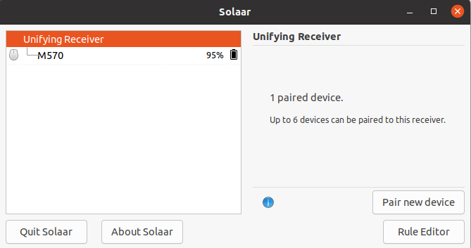
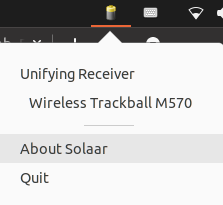

<div style="text-align: center; font-size: 14px; color: grey; margin-bottom: 20px;">this picture is from <a href="https://pwr-solaar.github.io/Solaar/installation" style="text-decoration: none;" >here</a>
</div>

## 概要
Ubuntu 20.04LTSでLogiteckの機器を使うための方法を備忘録として残しておく。

## 先に結論
- [Solaar](https://github.com/pwr-Solaar/Solaar)を使おう
- ubuntu 16.04以降は universal repositoryにあるが、これのバージョンが古い（v1.0.1）
- 1.0.1では不具合を起こす場合もあるので、最新（2021年9月5日現在 v1.0.6）をインストールする

## Solarrって？？
> Solaar is a Linux manager for many Logitech keyboards, mice, and trackpads that connect wirelessly to a USB Unifying, Lightspeed, or Nano receiver, connect directly via a USB cable, or connect via Bluetooth. Solaar does not work with peripherals from other companies.
（https://github.com/pwr-Solaar/Solaar より）

SolaarはLogitechのキーボード・マウス・トラックパッド用のLinux manager。インストールすることで、Logitech製の有線/無線機器がLinuxでも使えるようになる。

## 最新版をインストールしたいよねぇ
- ubuntu 16.04以降では、[universe repository](https://packages.ubuntu.com/search?keywords=solaar&searchon=names&suite=all&section=all)にあるものの、v1.0.1である。古い！
- 最新版（v1.0.6）のBug fixなどの恩恵を受けたい
- そこで、[Solaar stable ppa](https://launchpad.net/~solaar-unifying/+archive/ubuntu/stable) から最新版をインストールする

```bash
sudo add-apt-repository ppa:solaar-unifying/stable
sudo apt-get update
sudo reboot
```

- Solaarを立ち上げ、PCに挿した Unifying receiver を認識していればOK（下図参照）



- 機器がPairingされていなかったら `Pair new device` を押してペアリングする。画像では[Wireless Trackball M570](https://www.logicool.co.jp/ja-jp/products/mice/m575-ergo-wireless-trackball.910-005984.html)をペアリングしている（リンクは後継のM575の製品ページ）。
- また、UbuntuのステータスバーにもSolaarのステータスが出るようになっている


## 閑話

- LogitechとLogicoolって何が違うの？？と思って調べたが、どうやら過去の諸事情により、日本法人のみLogicoolを名乗り、グローバルではLogitechなようだ。
- 製品に違いは無いが、日本でサポートを受けられるのはLogicoolの商品のみとのこと
- 参考: [https://doslabo.com/blog/logicool-logitech](https://doslabo.com/blog/logicool-logitech)