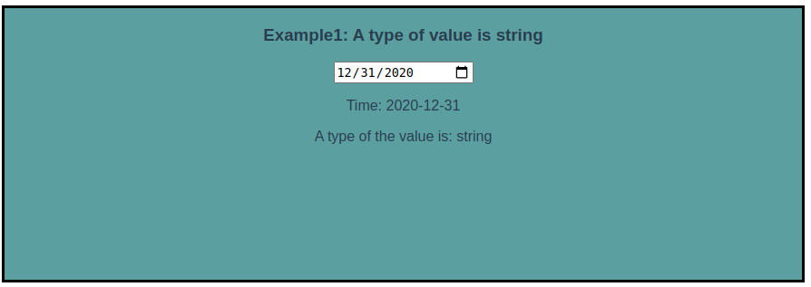
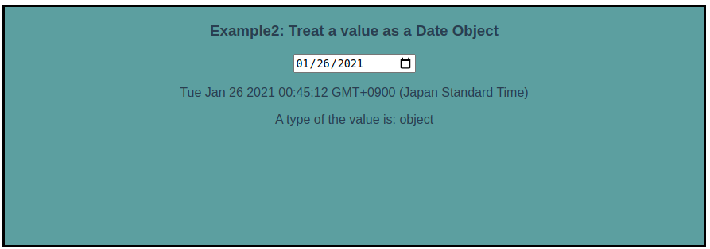

<div style="text-align: center; font-size: 14px; color: grey; margin-bottom: 20px;">this picture is from <a href="https://vuejs.org/" style="text-decoration: none;" >here</a>
</div>

In this article, I introduce you how to use a date input tag in the proper way with Vue.js.
The sample code of this article is [here](https://github.com/Shunpoco/vue-ts-input-values-demo).

### Problem
When I made a Vue component that contains a date input tag, I found that a value from the input tag returned its value as a string type. Even though I used TypeScript, it couldn't detect this behavior. I thought that it might cause bugs in the future (fig.1).

```html
<div>
	<input type="data" v-model="date1" />
	<p>Time: {{ date1 }}</p>
	<p>A type of the value is: {{ function () { return typeof date1; }() }}</p>
</div>
...
private date1!: Date;
```


<div style="text-align: center; font-size: 14px; color: grey; margin-bottom: 20px;">Fig.1: Time becames just a date and a type of the value is string.</div>

### Solution
Instead of `v-model` directive, we use both `v-bind` and `v-on` directives. `v-model` is a syntax sugar of these two directives (see [the oficial docs](https://vuejs.org/v2/guide/forms.html)), we can replace `v-model` like this:
```html
<input type="date"
  v-bind:value="dateToStr(date2)"
  v-on:input="date2 = strToDate($event.target.value)"
/>

...

  private date2!: Date;

  strToDate(str: string): Date {
    return new Date(str);

  dateToStr(date: Date): string {
    const year = date.getFullYear();
    const month = date.getMonth() + 1 < 9 ? `0${date.getMonth() + 1}` : `${date.getMonth() + 1}`;
    const day = date.getDate() < 9 ? `0${date.getDate()}` : `${date.getDate()}`;
    const strDate = `${year}-${month}-${day}`;
    return strDate;
  }
```
Then we define functions that converts a value from string type to Date Object type and vice versa, then call the functions in values of `v-bind` and `v-on:input`. Finally, the tag can pass the value in the proper type (fig.2).


<div style="text-align: center; font-size: 14px; color: grey; margin-bottom: 20px;">Fig.2: A type of the value is object and time shows datetime.</div>


### Conclusion
In order to use a date input tag with a proper type of value, we had better use both `v-bind` and `v-on:input` instead of using `v-model`.
